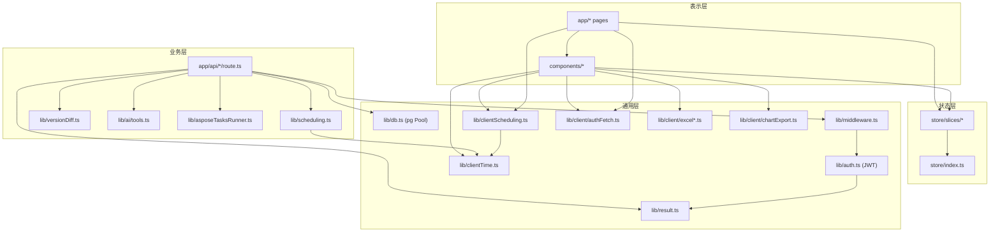
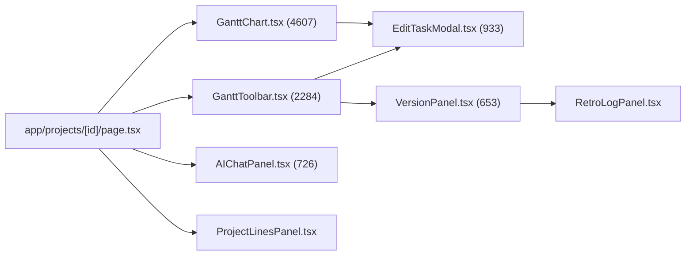
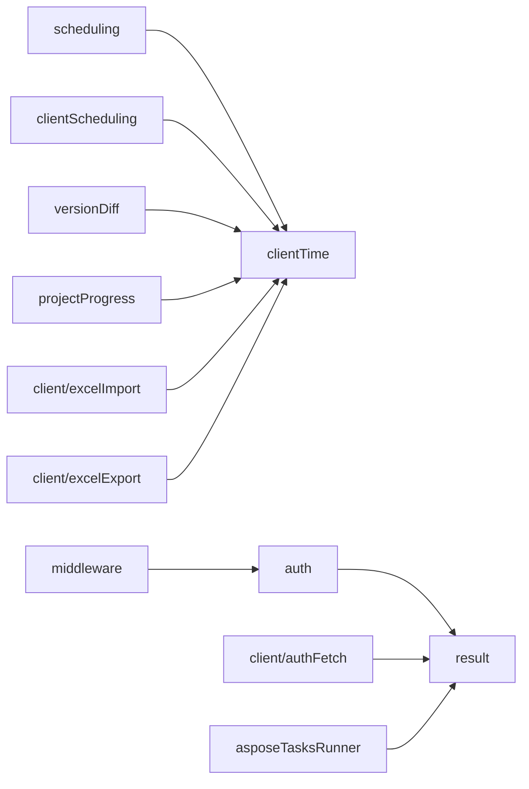
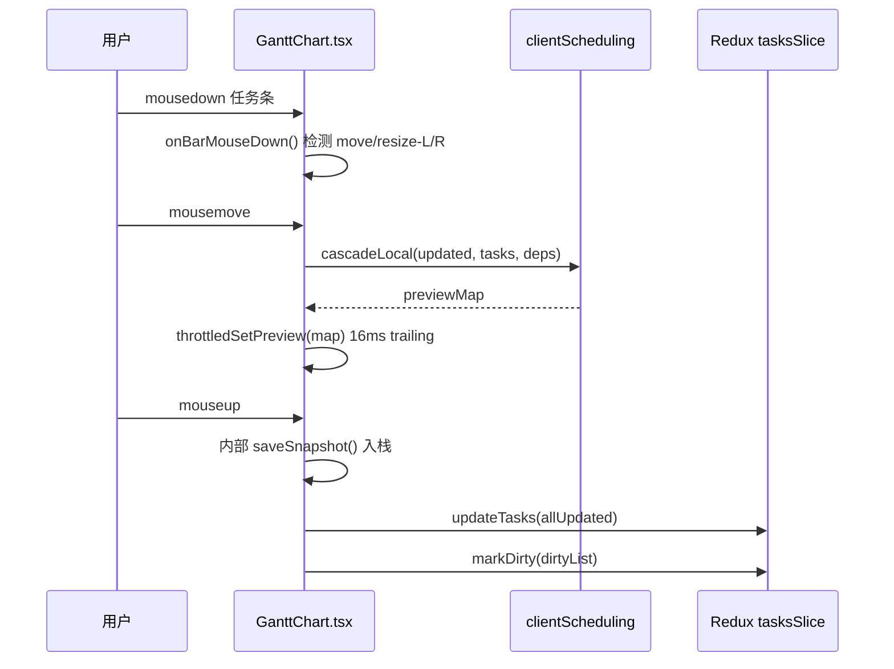
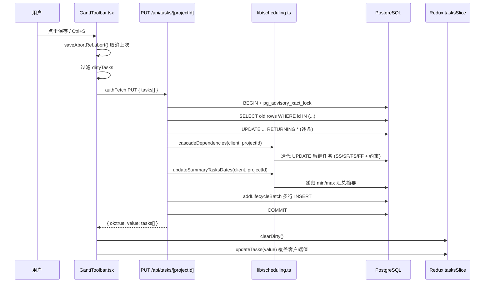
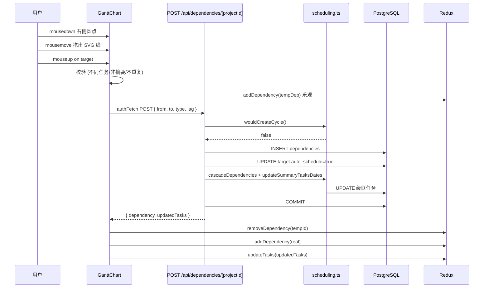
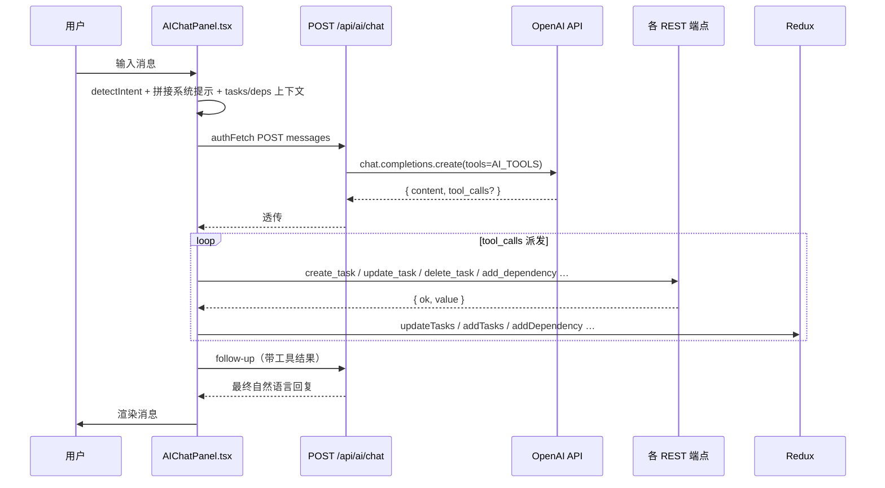

# 甘特图管理系统 — 项目调用图

> 配合 [`design.md`](./design.md) 阅读。本文聚焦**动态**：模块间的依赖箭头与关键运行时调用链。
> 所有 mermaid 图块在 GitHub / 现代编辑器中可直接渲染。

---

## 1. 模块依赖图（编译期 import）

### 1.1 顶层依赖



### 1.2 GanttChart 组件家族



### 1.3 lib 内部



---

## 2. 11 条核心运行时调用链

> 以 `文件:行` 标注关键调用点；行号会随重构漂移，必要时直接 grep 函数名。

### 2.1 任务条拖动（leaf）



### 2.2 保存改动（Ctrl+S / 工具栏）



### 2.3 创建任务

```
GanttToolbar.handleAddTask()
  → 计算默认 start/end (项目 start_date + N)
  → 计算 order_index = max(同级) + 1
  → authFetch POST /api/tasks/[projectId]
    └─ route.ts POST()
         BEGIN + lockProjectTx
         nextTaskCode()      SELECT MAX(task_code)+1
         normalizeDate()     与项目边界对齐
         INSERT tasks ... RETURNING *
         addLifecycle('created')
         updateSummaryTasksDates()
         COMMIT
  → dispatch(addTasks(newTask))
  → dispatch(setSelectedIds([id]))
```

### 2.4 删除任务（软删 + 递归）

```
GanttToolbar.handleDeleteTasks()
  → confirm()
  → authFetch DELETE /api/tasks/[projectId] { ids }
    └─ route.ts DELETE()
         lockProjectTx
         while (frontier 非空)
           SELECT id WHERE parent_id IN (frontier) AND NOT is_deleted
           allIds ∪= children
           frontier = children
         UPDATE tasks SET is_deleted=true, deleted_at=NOW() WHERE id IN allIds
         逐条 addLifecycle('deleted')
         COMMIT
  → dispatch(deleteTasks(value.deleted))
```

### 2.5 添加依赖（拖拽连线）



### 2.6 版本快照（确认变更）

```
GanttToolbar.handleConfirmChanges()
  ├─ Step 1: 校验 status_date 晚于上一版本
  ├─ Step 2: 重算所有任务 percent_done = calcPercent(task, statusDate)
  │           → PUT /api/tasks/[projectId]      （走调用链 2.2）
  ├─ Step 3: 保存脏任务                          （同 2.2）
  └─ Step 4: POST /api/versions/[projectId] { tasks, deps, status_date }
              └─ versions/route.ts POST()
                   version_number = MAX + 1
                   versionDiff.ts diffSnapshots(prev, cur)
                   INSERT project_versions (snapshot JSONB, changes JSONB)
                   COMMIT
              → dispatch(setComparison({ tasks, versionName }))
              → 刷新版本列表
```

### 2.7 Excel 导入

```
GanttToolbar.handleImport()
  ├─ excelImport.parseExcelFile(file)
  │     └─ 解析 Sheet → { tasks[], deps[] }
  ├─ excelImport.validateImportTasks()      （兼容分钟级 ISO 时间戳）
  ├─ 用户选择: replace / merge
  └─ POST /api/import/[projectId]
        └─ import/route.ts POST()
             lockProjectTx
             if replace: UPDATE is_deleted=true (旧任务全部)
             逐条 INSERT tasks (auto task_code)
             建立 task_code → id 映射
             逐条 INSERT dependencies (按映射解析 from/to)
             cascadeDependencies + updateSummaryTasksDates
             COMMIT
             读最终状态 → 调用 versions/POST 自动建快照
        → dispatch(setTasks({ tasks, deps }))
        → dispatch(setComparison(...))
```

### 2.8 AI 对话（OpenAI tool_calls）



### 2.9 内联编辑（任务名 / 工期 / 日期 / 责任人）

```
双击 → setCellEdit({ taskId, field, value })

任务名提交 (commitName):
  nameCommittedRef 防重复 (Enter+blur 同时触发)
  editNameRef.current 取最新值（闭包防过期）
  内部 saveSnapshot + updateTasks + markDirty

单元格提交 (commitCellEdit):
  duration  : 依赖类型决定固定 start 还是 end
  start_date: 仅 FF/SF 允许编辑，重算 duration
  end_date  : 重算 duration
  → clientScheduling.cascadeLocal(updated, tasks, deps)
  → updateTasks(含级联) + markDirty(含级联)
```

### 2.10 撤销 / 重做（GanttChart 内部）

```
Ctrl+Z:
  GanttToolbar 监听 → 派发自定义事件 'gantt-undo'
  GanttChart 接收:
    redoStack.push(当前快照)
    prev = undoStack.pop()
    setLocalTasks(prev.tasks); setLocalDeps(prev.deps)
    dispatch(updateTasks(prev.tasks))

Ctrl+Y:
  对称：undoStack ← 当前；next = redoStack.pop()

saveSnapshot() 调用点：
  · 拖动 mouseup
  · 内联编辑提交
  · 依赖连线完成
  · 行排序
  · 工具栏 create/delete/copy/paste/indent/outdent
  · AIChatPanel 每次 tool 调用前

约束：内存 ref 栈，最多 50 层，刷新丢失。
```

### 2.11 MPP 导入 / 导出（child_process）

```
导入：
  POST /api/mpp/parse  (multipart file)
    └─ asposeTasksRunner.parseMpp(buffer)
         spawn('dotnet', ['aspose-tasks-cli/.../parse.dll', tmpFile])
         JSON via stdout
    → 返回 { tasks, deps }
    → 走 Excel 导入相同的入库流程

导出：
  POST /api/mpp/build  { tasks, deps }
    └─ asposeTasksRunner.buildMpp(input)
         spawn('dotnet', ['aspose-tasks-cli/.../build.dll'], input via stdin)
         outFile via stdout
    → 返回 .mpp Buffer
    → 浏览器下载
```

---

## 3. 写路径模式（统一架构）

```
┌─────────────────────────────────────────────────────────────┐
│ UI 事件（拖动 / 双击 / 工具栏 / AI 工具调用）                │
└──────────────────────┬──────────────────────────────────────┘
                       ▼
           ┌────────────────────────┐    ┌──────────────────┐
           │ 客户端级联预览          │    │ Redux Store      │
           │ clientScheduling.ts    │───▶│ updateTasks(乐观)│
           │ trailing throttle 16ms │    │ markDirty(ids)   │
           └────────────────────────┘    └────────┬─────────┘
                                                  │ Save / 立即
                                                  ▼
                                       ┌──────────────────┐
                                       │ authFetch + 30s  │
                                       │ AbortController  │
                                       └────────┬─────────┘
                                                ▼
┌─────────────────────────────────────────────────────────────┐
│ Route Handler:                                              │
│   1. getAuthUser + requireWrite                             │
│   2. verifyProjectOwnership                                 │
│   3. BEGIN + pg_advisory_xact_lock(hashtext(projectId))     │
│   4. 业务校验 + UPDATE/INSERT                                │
│   5. cascadeDependencies()                                  │
│   6. updateSummaryTasksDates()                              │
│   7. addLifecycleBatch()                                    │
│   8. COMMIT                                                 │
└──────────────────────┬──────────────────────────────────────┘
                       ▼
          ┌────────────────────────┐
          │ Redux                  │
          │ updateTasks(服务端值)  │ ← 服务端确认覆盖乐观值
          │ clearDirty()           │
          └────────────────────────┘
```

---

## 4. 鉴权调用链

```
浏览器 ──cookie token / Authorization: Bearer──▶ Route Handler
  └─ getAuthUser(req)            (lib/middleware.ts)
       └─ verifyToken(token)     (lib/auth.ts)  jsonwebtoken.verify(HS256)
            └─ Result<JwtPayload>
  └─ requireWrite(auth)?  (写端点)
       view 角色 → return 403
  └─ requireAdministrator(auth)?  (用户管理端点)
       非 administrator → return 403
  └─ verifyProjectOwnership(projectId, userId)  (项目级端点)
       SELECT id FROM projects WHERE id=$1 AND user_id=$2
       false → 404
```

---

## 5. 调度引擎内部调用

```
cascadeDependencies(client, projectId)
  ├─ SELECT dependencies JOIN tasks (active 任务)
  ├─ SELECT tasks (含 auto_schedule / inactive / 约束)
  ├─ 构造 taskMap / constrainedIds
  ├─ isInactive(id)        递归祖先
  ├─ isAncestor(a, b)
  ├─ depsByTo 分组 (过滤父子 / inactive / active=false)
  └─ while (changed && iter<500):
        for each toId:
          if auto_schedule==false: continue
          maxRequired = max( FS/SS/FF/SF 公式 )
          应用 muststarton / mustfinishon / *noearlierthan
          UPDATE start_date, end_date, duration

updateSummaryTasksDates(client, projectId)
  └─ SELECT DISTINCT parent_id
       └─ updateSummaryTaskDateRecursive(client, parentId, collected, visited)
            ├─ 取子任务 min(start), max(end)
            ├─ 首次成为摘要: 保存 original_start/end_date
            ├─ 子任务清空: 从 original_* 恢复（叶子化）
            ├─ UPDATE start/end/duration
            └─ 递归 parent_id 向上
```

---

## 6. 数据流总览（全景）

```mermaid
flowchart LR
  subgraph Browser
    Page
    Comps
    Redux
    LocalStore[localStorage / sessionStorage]
  end

  subgraph Node[Next.js Node Runtime]
    Routes
    Lib[lib/*]
    Pool[pg Pool]
  end

  PG[(PostgreSQL 18)]
  OpenAI[(OpenAI API)]
  Dotnet[dotnet aspose-tasks-cli]

  Page <--> Redux
  Comps <--> Redux
  Page -- authFetch --> Routes
  Comps -- authFetch --> Routes
  Redux <--> LocalStore

  Routes --> Lib
  Lib --> Pool
  Pool <--> PG

  Routes -- chat.completions --> OpenAI
  Routes -- child_process --> Dotnet
  Dotnet -. .mpp .-> Routes
```
